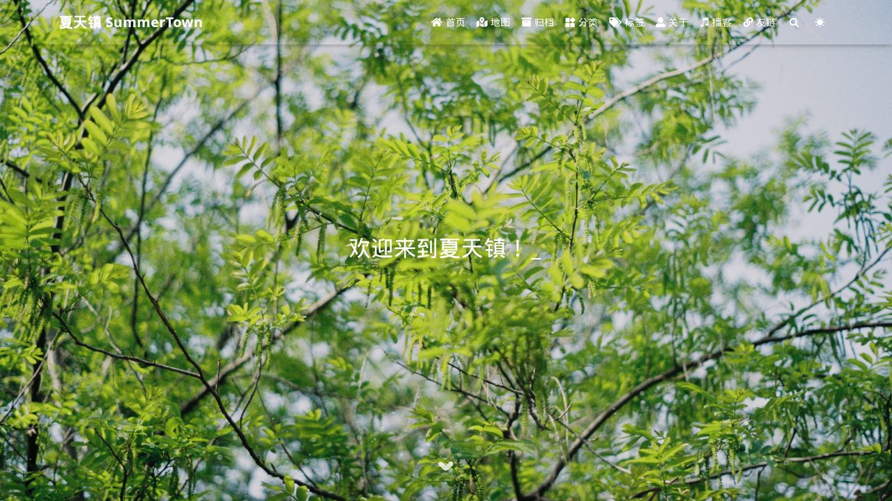

# 🏖️ 夏天镇 · SummerTown

**欢迎来到夏天镇**

## 📖 关于小镇

**夏天镇 SummerTown** 是 **大夏** 的个人博客与生活小站——“不是什么正经项目，只是一个用来存放日常、实验和碎碎念的地方。”镇上有一只常驻猫咪（右下角那只会动的 [Live2D](https://github.com/xiazeyu/live2d-widget.js) 猫）。

*"But thy eternal summer shall not fade, nor lose possession of that fair thou ow'st."* 
愿你的长夏永不凋零 ☀️

这句话译自莎士比亚的《十四行诗第18首》（*Sonnet 18*），也是小镇最初的立镇宣言。

本仓库（`summerpapaya.github.io`）是小镇网站通过 [Hexo](https://hexo.io) 生成、并部署到 **GitHub Pages** 的静态站点产物，通过自定义域名 [www.summercommences.com](https://www.summercommences.com) 对外开放。

## 🏘️ 小镇的三个版块

| 版块 | 说明 | 入口 |
| --- | --- | --- |
| 📖 **部落格** | 镇民的日常唠嗑、随笔与碎碎念 | [/categories/部落格/](https://www.summercommences.com/categories/%E9%83%A8%E8%90%BD%E6%A0%BC/) |
| 💻 **实验室** | Vibe Coding、AI 小玩意儿等各种小实验 | [/categories/实验室/](https://www.summercommences.com/categories/%E5%AE%9E%E9%AA%8C%E5%AE%A4/) |
| 📷 **照相馆** | 收集按下快门的瞬间 | [/categories/照相馆/](https://www.summercommences.com/categories/%E7%85%A7%E7%9B%B8%E9%A6%86/) |

常见标签：`#一颗苹果` `#小火花儿` `#AI Lab` `#Vibe Coding` `#HTML`

## 🗺️ 站点地图

| 页面 | 路径 | 说明 |
| --- | --- | --- |
| 🏠 首页 | `/` | 最新文章列表 |
| 🗺️ 地图 | `/map/` | [交互式地图](https://summertown.summercommences.com)，小镇版图持续建设ing |
| 🗄️ 归档 | `/archives/` | 全部文章按时间归档 |
| 🗂️ 分类 | `/categories/` | 文章分类 |
| 🏷️ 标签 | `/tags/` | 标签云 |
| 👤 关于 | `/about/` | GitHub 打卡记录 + 访问者地图 |
| 🎧 播客 | `/podcast/` | 播客「夏天镇 SummerTown」和「风铃屿 Windbell Isle」主页 |
| 🔗 友链 | `/links/` | 小镇友邻们 |

## 🧰 建镇工具箱

小镇由以下技术拼凑而成：

- **静态站点生成**：[Hexo](https://hexo.io) 8.1.1 + [Fluid 主题](https://github.com/fluid-dev/hexo-theme-fluid) 1.9.8
- **前端基础**：Bootstrap 4、iconfont 图标、AnchorJS、NProgress
- **搜索**：本地全文搜索（`local-search.xml`）
- **评论**：[Waline](https://waline.js.org/)
- **音乐 / 播客播放器**：APlayer + [MetingJS](https://github.com/metowolf/MetingJS)
- **看板娘**：[live2d-widget](https://github.com/xiazeyu/live2d-widget.js)（tororo 猫模型）
- **统计与访客地图**：Google Analytics、不蒜子（busuanzi）、LeanCloud、ClustrMaps、GitHub 打卡图（ghchart）
- **深浅色模式**：跟随系统 / 时间自动切换，也可手动切换
- **托管**：GitHub Pages，`CNAME` 绑定自定义域名 `summercommences.com`

## 🚀 关于这个仓库

`summerpapaya.github.io` 遵循 GitHub Pages 的用户站点约定：仓库里保存的是 `hexo generate` 产出的**编译后静态站点**（`index.html`、`css/`、`js/`、各文章页面等），并直接由 GitHub Pages 从默认分支渲染发布。也就是说：

- 这里看到的是**构建产物**，不包含 Markdown 文章源文件、Hexo 配置或主题源码；
- 内容更新流程通常是：在本地 Hexo 项目里写好文章 → `hexo generate` → 部署脚本把生成结果推送到这个仓库；
- 如果你只是路过，直接访问 [www.summercommences.com](https://www.summercommences.com) 就能看到最新的小镇风景，无需在本地跑起这个仓库。

## 🐾 鸣谢

- [Hexo](https://hexo.io) —— 快速、简洁且高效的博客框架
- [Fluid](https://github.com/fluid-dev/hexo-theme-fluid) —— 本站使用的 Hexo 主题（MIT License）
- [live2d-widget](https://github.com/xiazeyu/live2d-widget.js) —— 陪伴看板娘
- [beautify-github-readme](https://github.com/oil-oil/beautify-github-readme) —— 本站使用的README文件美化skill（MIT License）
- 以及所有在小镇里留下脚印的朋友们 🐾

---

用 ☀️ 与 🍎 建造 · [GitHub](https://github.com/SummerPapaya) · [RSS](https://www.summercommences.com/atom.xml)

